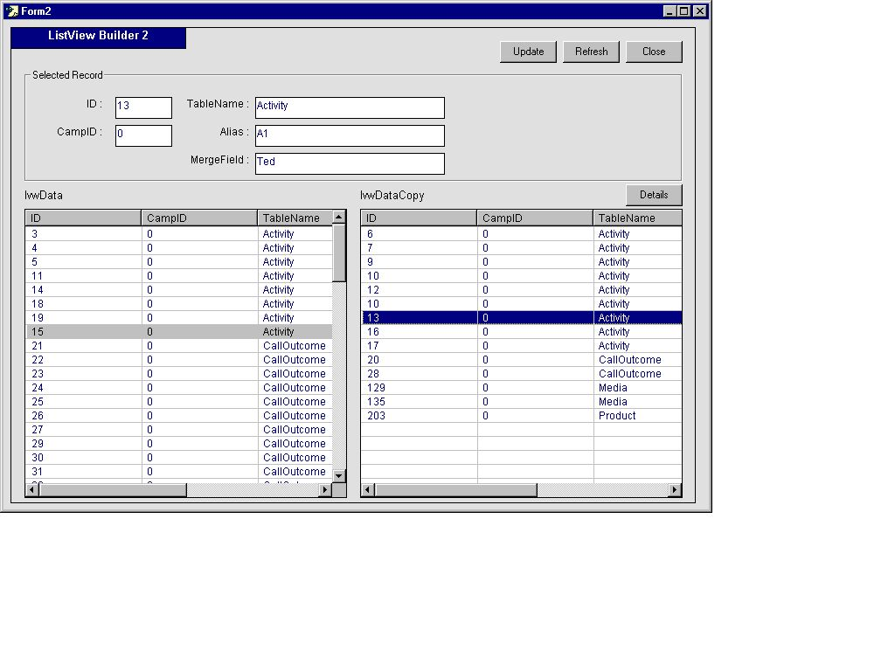



## ListView Builder 2

### Description

This is the second part of the ListView Builder sample. There is some more functionality that works with the ListView object. Updating a database from a ListView etc.

Keywords: Drag and Drop (OLEDragDrop), ListView, TextBox, array, ADODB.Connection, HotCode...

By request, I have added a function 'RecordDetails' that will do a SQL selection based on an item in the ListView...
 
### More Info
 

             |
---                |---
**Submitted On**   |2002-11-28 12:08:06
**By**             |[GazMan](https://github.com/Planet-Source-Code/PSCIndex/blob/master/ByAuthor/gazman.md)
**Level**          |Intermediate
**User Rating**    |4.8 (24 globes from 5 users)
**Compatibility**  |VB 5\.0, VB 6\.0
**Category**       |[Complete Applications](https://github.com/Planet-Source-Code/PSCIndex/blob/master/ByCategory/complete-applications__1-27.md)
**World**          |[Visual Basic](https://github.com/Planet-Source-Code/PSCIndex/blob/master/ByWorld/visual-basic.md)
**Archive File**   |[ListView\_B15046311282002\.zip](https://github.com/Planet-Source-Code/gazman-listview-builder-2__1-41085/archive/master.zip)

